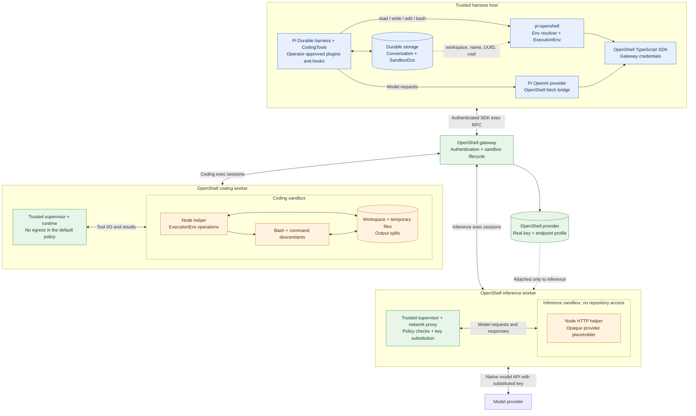

# pi-openshell

Run a trusted Pi Durable harness on the host with separate OpenShell sandboxes
for coding tools and model HTTP requests. Durable storage stays on the host.

Model HTTP requests can also run through a sandbox helper. An attached OpenShell
provider supplies an opaque credential placeholder; OpenShell substitutes the
real API key at the profile-authorized endpoint. The Pi process needs no model
API key.

This version implements Pi Durable 1.0.0's complete `ExecutionEnv`, a conversation
document resolver, OpenAI Responses transport, and operator-side deployment
helpers. Automatic worker replacement, execution reattachment, and an interactive
Pi coding-agent extension are follow-up work. This is a Durable application
package; it does not currently register an extension through `pi install`.

## Architecture



The tool resolver reads a coding binding from `SandboxDoc`; model requests use
the separately configured inference binding. Both go through authenticated SDK
exec sessions. OpenShell policy enforces each worker's filesystem, network, and
process boundary. Pi, this package, and the SDK do not need to be installed in
either workload image.

The model client, durable state, and gateway credentials remain on the host.
Model HTTP connections originate inside the inference sandbox; real model credentials
remain in OpenShell's trusted components and are substituted by its network proxy.
Host plugins and hooks remain trusted JavaScript and can use native Node APIs;
`ExecutionEnv` confines only work routed through it. The operator creates and
deletes the workers explicitly; closing the harness keeps them available for
restart.

## Install

Node.js 22.19 or later is required on the harness host. Both workload images need
Node.js 22 or later in Linux; coding also needs Bash. Neither needs Pi, this
package, or the OpenShell SDK. The coding filesystem policy must permit the working and temporary
directories, executable/library paths, and read access to `/proc` process metadata
for descendant cleanup. Commands receive immediate stdin EOF through a pipe;
the adapter does not require access to `/dev/null`.

The deployment helpers use the community base image, the `sandbox` user/group,
and `/usr/bin/node` by default. Custom images must provide that user/group and
the configured executables. Review the policies and provider profile when
changing images or executable paths.

```shell
npm install git+https://github.com/mrunalp/pi-openshell.git @earendil-works/pi-durable@1.0.0 @earendil-works/pi-ai@1.0.0
```

OpenShell's SDK is currently distributed through GitHub Packages. Follow the
[SDK installation instructions](https://github.com/NVIDIA/OpenShell/tree/main/sdk/typescript),
then install `@nvidia/openshell-sdk` separately. It is an optional peer dependency
so this package's tests and core adapter can be installed without private-registry
credentials. The SDK's `execInteractive()` must expose `cancel()` and
`closeInput()`. Use an SDK compatible with your gateway. Development against an
OpenShell checkout can use its built `sdk/typescript` package.

## Attach to an existing sandbox

Create a sandbox from an image containing Node and Bash. Keep its canonical main
process running; helper processes run as sandbox exec sessions.

```js
import { OpenShellClient } from "@nvidia/openshell-sdk";
import { OpenShellExecutionEnv } from "pi-openshell";
import { BACKGROUND_CONTEXT } from "@earendil-works/chord/context";

const client = await OpenShellClient.connect({
  gateway: "https://gateway.example.com",
  oidcToken: process.env.OPENSHELL_TOKEN,
});
const sandbox = await client.sandbox.get("worker", { workspace: "default" });
const env = new OpenShellExecutionEnv({
  client: client.sandbox,
  binding: { id: sandbox.id, name: sandbox.name, workspace: sandbox.workspace },
  cwd: "/sandbox/work",
  nodePath: "/usr/bin/node", // Official Node images use /usr/local/bin/node.
});

const result = await env.exec("git status --short", {
  timeout: 30,
  onOutput: (text) => process.stdout.write(text),
}, BACKGROUND_CONTEXT);
if (!result.ok) throw result.error;
console.log(`Exit code: ${result.value.exitCode}`);
```

The gateway authentication remains in the harness process. No host environment
variables or credentials are copied to the worker. `inheritEnv` applies to the
sandbox environment; explicit shell `env` overrides are sent to the sandbox.

## Use with Pi Durable

Install the standard `CodingTools` and supply `createOpenShellEnvResolver()` as
the harness's `env` option. Assign the existing sandbox in the same commit that
creates a conversation:

```js
import { createRegistry, Harness } from "@earendil-works/pi-durable";
import { CodingTools } from "@earendil-works/pi-durable/tools";
import { createOpenShellEnvResolver, SandboxDoc } from "pi-openshell";

const registry = createRegistry();
registry.install(CodingTools);
const harness = await Harness.open(storage, {
  models,
  registry,
  env: createOpenShellEnvResolver({ client: client.sandbox }),
}, context);

const conversation = await harness.createConversation({
  ownership: { kind: "ownerless" },
  agent: { model: { provider: "openai", modelId: "your-model" } },
  init: async (tx, id) => {
    const doc = await tx.doc(SandboxDoc, id);
    doc.binding = { id: sandbox.id, name: sandbox.name, workspace: sandbox.workspace };
    doc.cwd = "/sandbox/work";
  },
}, context);
```

`storage`, `models`, and `context` are the application's normal Pi Durable setup.
See [examples/durable.mjs](examples/durable.mjs) for a complete runnable harness
with SQLite storage, a real model provider, and the OpenShell SDK.

The example requires distinct coding and inference bindings, supplied through
a deployment file or explicit sandbox names. It does not read a model API key
from the host.

The document uses `fork: "initial"`. A conversation fork receives no sandbox
binding. Its tools fail without an environment until the application explicitly
assigns a sandbox. A transcript fork never implies a filesystem snapshot.

Each persistent store must have one harness owner at a time. The example's
SQLite store supports process-crash recovery; Pi's default SQLite durability
settings do not promise preservation of the latest commit after a power failure.

## Model credentials through OpenShell

The OpenAI Responses integration keeps Pi's model client on the host and sends
its HTTP requests through a Node helper in the bound sandbox. The helper reads
`OPENAI_API_KEY` from the sandbox's provider environment, where OpenShell supplies
an opaque placeholder. OpenShell checks network policy and credential endpoint
binding before substituting the stored key. The bridge never retrieves a key or
placeholder into the harness and never copies host auth headers into a request.

Review [providers/openai-node.yaml](providers/openai-node.yaml) for the inference
image, then import it and create a provider on the same gateway/workspace used
by the SDK:

```shell
openshell profile lint -f providers/openai-node.yaml
openshell profile import -f providers/openai-node.yaml
openshell provider create --name pi-openai --type pi-openai-node --from-existing
```

`--from-existing` discovers the credential in the operator's setup environment.
The deployment command below attaches it only to the inference worker. In an
application, register the managed model provider with that worker's binding:

```js
import { createModels } from "@earendil-works/pi-ai/models";
import { createOpenShellOpenAIProvider } from "pi-openshell";

const provider = createOpenShellOpenAIProvider({
  client: client.sandbox,
  binding: inference.binding,
  nodePath: inference.nodePath,
});
const models = createModels();
models.setProvider(provider);
// Pass models to Harness.open(); call provider.cleanup() after closing it.
```

Requests use SSE, preserve HTTP errors, and stream response bodies back to Pi.
The factory pins the native base URL and transport, uses a non-secret Pi auth
sentinel, and disables retries. The bridge rejects URL escapes and does not
follow redirects. Missing or revoked provider access fails without direct host
networking. Request bodies default to an 8 MiB limit; calls default to a ten-minute
timeout. HTTP redirects and WebSocket transports are not supported.

For an OpenAI-compatible endpoint, set `baseUrl` and import a separate profile
authorizing that endpoint. `credentialEnv` selects its sandbox placeholder
variable. `allowHttp: true` is available for an explicitly configured local HTTP
service. `createOpenShellFetch()` also exposes the transport directly for custom
clients; automatic Pi provider setup currently covers OpenAI Responses only.

The model provider's binding is application configuration, independent of the
conversation's tool environment. An authorized harness can submit requests and
consume model quota even though it never holds the stored key.

## Deploy separate workers

From this checkout, install dependencies, build the package, and set
`OPENSHELL_ENDPOINT` plus the gateway token or mTLS file variables described in
the live-test section. Create the provider as above, then:

```shell
export OPENSHELL_DEPLOYMENT=./deployment.json
export OPENSHELL_INFERENCE_PROVIDER=pi-openai
npm run deploy:create

env -u OPENAI_API_KEY PI_MODEL=gpt-4.1-mini \
  node examples/durable.mjs "Inspect the workspace"
```

The setup command creates two workers and waits for both to become ready:

| Worker | Filesystem | Network and credentials |
|---|---|---|
| Coding | Writable `/sandbox/work` and `/tmp`; process metadata for command cleanup | No providers attached and no network grants by default |
| Inference | Runtime/library/CA paths and writable `/tmp`; `/sandbox` excluded | Only the supplied provider is attached; its profile supplies endpoint policy and credential binding |

The policies are in [policies/coding.json](policies/coding.json) and
[policies/inference.json](policies/inference.json), expressed as SDK policy
objects. Review them before provisioning. Add required build/dependency endpoints
to the coding policy explicitly, keeping inference credentials on the inference
worker. The inference image receives no repository mount. Inspect the effective
policies, including any gateway-global overrides, with `openshell policy get
<name> --full`.

`deployment.json` records worker UUIDs, names, workspaces, executable paths, and
the coding directory. It contains no credentials and is ignored by git. Setup
refuses to overwrite an existing deployment file. Restart the harness with the
same file and `PI_STORAGE`; startup validates both UUIDs and never falls back to
the coding worker for inference. Missing, replaced, or shared workers are errors.
The conversation's saved coding binding also prevents accidental workspace
rebinding when reopening its durable store.

Optional setup variables are `OPENSHELL_WORKSPACE`, `OPENSHELL_SANDBOX` and
`OPENSHELL_INFERENCE_SANDBOX` for worker names, `OPENSHELL_CODING_IMAGE` and
`OPENSHELL_INFERENCE_IMAGE` for images, and `OPENSHELL_NODE_PATH` and
`OPENSHELL_INFERENCE_NODE_PATH` for Node paths. Both provisioned workers use the
selected workspace. Closing Pi keeps the workers running; to remove them after
stopping the harness:

```shell
npm run deploy:delete
```

Teardown validates the recorded UUIDs, removes both workers and the deployment
file, and retains the provider and Pi's durable store. Provisioning failures
attempt to roll back workers created by that invocation. A lost create response
or process crash can leave resources; inspect the `pi-openshell.deployment` and
`pi-openshell.role` labels before manual cleanup. Do not automatically retry
uncertain provisioning outcomes.

For existing workers, attach the provider only to the inference sandbox and
provide both names instead of `OPENSHELL_DEPLOYMENT`:

```shell
openshell sandbox provider attach inference-worker pi-openai --wait
env -u OPENAI_API_KEY \
  OPENSHELL_SANDBOX=coding-worker \
  OPENSHELL_INFERENCE_SANDBOX=inference-worker \
  PI_MODEL=gpt-4.1-mini \
  node examples/durable.mjs "Inspect the workspace"
```

Unset `OPENSHELL_DEPLOYMENT` for name-based configuration. It also supports
`OPENSHELL_INFERENCE_WORKSPACE` (default: coding workspace) and `OPENSHELL_CWD`
(default: `/sandbox/work`). Existing workers must have the required policies,
executables, and coding directory already configured. Use a saved deployment
file when you need UUID-pinned restart configuration. In an installed package,
the operator helpers are under `node_modules/pi-openshell/examples/` and can be
invoked with `node` directly.

## Execution and recovery

- Each remote operation runs a dependency-free Node helper through the SDK's
  non-TTY interactive exec. Its source is read from this installed package and
  transmitted as an argument; paths and content are a structured stdin frame.
- Every actual filesystem access, symlink resolution, shell command, and spill
  file lives in the sandbox. POSIX path joining on the harness performs no I/O.
- Line readers stream with backpressure and preserve CRLF and whether the final
  line ends in a newline. Binary data uses base64 framing.
- Shell output streams as it arrives. Nonzero command exit codes remain normal
  `ShellExecResult` values for Pi's Bash tool to interpret. Timeouts, cancellation,
  and callback failures stop ordinary members of the helper's shell process group.
- Cancellation sends a control frame and keeps the exec stream alive while the
  helper stops and reaps the command. It falls back to transport cancellation
  after two seconds. A lost connection or forced helper termination can leave
  descendants running; sandbox teardown remains the final cleanup boundary.
- OpenShell denies workload group/broadcast signals. The helper reads `/proc`
  metadata, freezes matching group members, and signals them individually through
  OpenShell's broker. It checks group membership and process birth times and
  refuses to act on a replacement group leader.
- On completion the helper cleans up ordinary members of its shell process group.
  A program that deliberately creates another process group can remain inside the sandbox;
  strict per-call process-tree ownership requires additional backend support.
  Sandbox teardown is the final cleanup boundary. Use a separate sandbox main
  process or explicit lifecycle API for background services.
- Full shell output spills into sandbox-local files when thresholds are crossed.
  Completed spills remain until the application or sandbox lifecycle removes them.
- Defaults are 8 MiB per file transfer, 1 MiB per streamed line, 10,000 directory
  entries, and 30 seconds per ordinary filesystem operation. Transfer limits are
  configurable. Line-reader lifetimes and shell calls follow their cancellation
  contexts; shell timeouts are explicit.
- A lost connection, malformed response, missing exit, or failed final RPC is an
  error. Operations are never retried automatically. A write or command may have
  taken effect before the error: treat that outcome as uncertain.

Keep arbitrary shell commands and mutations non-replayable in Pi. Neither the
adapter nor a transcript checkpoint makes external side effects exactly-once.

## Trust boundary

Only operator-approved JavaScript belongs in the managed harness. Custom tools,
hooks, wrappers, prompt renderers, and tasks execute there and can bypass
`ExecutionEnv` using native Node APIs. This package confines the work delegated
through its environment; it does not sandbox other plugins loaded into the host.

OpenShell's admitted filesystem and network policy enforce the worker boundary.
`cwd` is not a filesystem jail. Set static controls before sandbox creation and
keep sandbox management credentials outside agent-controlled code. Model calls
through `createOpenShellOpenAIProvider()` use the bound sandbox's attached
provider and effective network policy. Other host model clients retain their
own inference configuration and can bypass this integration.

The adapter checks the bound sandbox UUID, name, and workspace before every
operation. The deployment helper also verifies both UUIDs before teardown.
Current public exec and SDK deletion target sandboxes by name, so these checks
are not atomic with the operation. Do not delete and reuse a bound name while a
harness or deployment command is active. Server-side expected-UUID preconditions
are required to remove this race.

## Develop and verify

```shell
npm ci
npm run check
npm pack --dry-run
```

Tests execute the actual helper in child processes through a test-only SDK
fixture, then drive Pi Durable's real built-in read/write/edit/bash tools through
the adapter. They also check fork behavior, binary and metacharacter handling,
spill preservation, cancellation of descendants, stale bindings, and incomplete
transport responses. The test fixture is not a local fallback shipped to users.

For a live SDK/gateway test, install the SDK and provide an existing sandbox:

```shell
OPENSHELL_ENDPOINT=http://127.0.0.1:17670 \
OPENSHELL_SANDBOX=worker \
OPENSHELL_CWD=/sandbox/work \
npm run test:live
```

Optional variables are `OPENSHELL_WORKSPACE` (default `default`),
`OPENSHELL_NODE_PATH` (default `/usr/bin/node`), `OPENSHELL_TOKEN`, and the PEM
file paths `OPENSHELL_CA_FILE`, `OPENSHELL_CLIENT_CERT_FILE`, and
`OPENSHELL_CLIENT_KEY_FILE`. TLS verification remains enabled.

The live tests check text and binary transfers (including a 2 MiB file), streamed
lines, shell output, nonzero exit codes, spill files, timeout and cancellation of
descendants, and Pi Durable's actual read/write/edit/bash tools. A deterministic
model drives the harness; no model API key is required. The Durable test also
checks that an unbound conversation fork cannot modify the assigned sandbox.

Each tool test uses a unique temporary directory in the sandbox and removes that
directory afterward. The tests do not create or delete sandboxes.

For the complete deployment, use a local gateway reachable from this machine's
`host.openshell.internal` address. From this source checkout, with the same
gateway/TLS variables set, run:

```shell
npm run test:deployment:live
```

This separate test creates a temporary profile, provider with a synthetic key,
and two workers using the same deployment helper as setup. It verifies coding
network denial and absent model credentials, inference filesystem isolation,
placeholder substitution, and a Pi Durable model-driven read/write/edit/bash
sequence. Provider detachment blocks the next call. The test removes those
resources afterward. `test:provider:live` remains an alias. It uses a host-local
mock Responses API over HTTP and no paid model service;
the caller needs permission to manage profiles, providers, and sandboxes.

Locally verified on October 1, 2026 with Pi Durable 1.0.0, the TypeScript SDK and
gateway/runtime/supervisor built from OpenShell commit `76cfd0e31d5e`, rootless
Podman, mTLS, and the community base workload image with Node 22.22.1. Tool-only
tests used a deterministic model. The two-worker test verified the default
deployment policies and real OpenShell substitution against the local mock
Responses API, with Pi's real OpenAI client and Durable harness. Paid provider
calls, external upstream TLS, and crash recovery were
not exercised.
